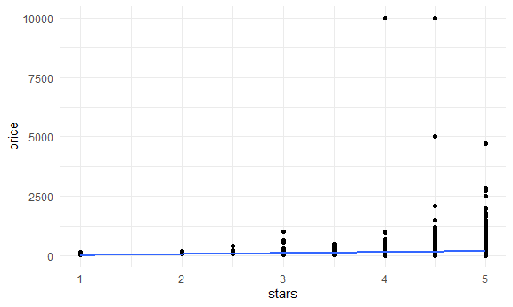
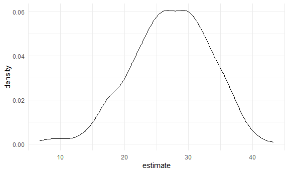

Bootstrapping
================
Jinghan Zhao
2024-11-14

Do some bootstrapping!

Make up some data.

``` r
n_samp = 250

sim_df_constant = 
  tibble(
    x = rnorm(n_samp, 1, 1),
    error = rnorm(n_samp, 0, 1),
    y = 2 + 3 * x + error
  )

sim_df_nonconstant = 
  sim_df_constant %>% 
  mutate(
    error = error * 0.75 * x,
    y = 2 + 3 * x + error
  )
```

Let’s look at these.

``` r
sim_df_constant %>% 
  ggplot(aes(x = x, y = y)) +
  geom_point() +
  stat_smooth(method = "lm")
```

    ## `geom_smooth()` using formula = 'y ~ x'


``` r
sim_df_nonconstant %>% 
  ggplot(aes(x = x, y = y)) +
  geom_point() +
  stat_smooth(method = "lm")
```

    ## `geom_smooth()` using formula = 'y ~ x'


Error is depend on x in `sim_df_nonconstant`, so the linear regression
is not valid.

Look at regression results.

``` r
sim_df_constant %>% 
  lm(y ~ x, data = .) %>% 
  broom::tidy() %>% 
  knitr::kable(digits = 3)
```

| term        | estimate | std.error | statistic | p.value |
|:------------|---------:|----------:|----------:|--------:|
| (Intercept) |    1.977 |     0.098 |    20.157 |       0 |
| x           |    3.045 |     0.070 |    43.537 |       0 |

``` r
sim_df_nonconstant %>% 
  lm(y ~ x, data = .) %>% 
  broom::tidy() %>% 
  knitr::kable(digits = 3)
```

| term        | estimate | std.error | statistic | p.value |
|:------------|---------:|----------:|----------:|--------:|
| (Intercept) |    1.934 |     0.105 |    18.456 |       0 |
| x           |    3.112 |     0.075 |    41.661 |       0 |

## Draw a bootstrap sample

``` r
boot_sample = function(df) {
  
  boot_df = 
    sample_frac(df, size = 1, replace = TRUE) %>% 
    arrange(x)
  
  return(boot_df)
  
}
```

Let’s try running this!

``` r
sim_df_nonconstant %>% 
  boot_sample() %>% 
  ggplot(aes(x = x, y = y)) +
  geom_point(alpha = .5) +
  stat_smooth(method = "lm")
```

    ## `geom_smooth()` using formula = 'y ~ x'


Some points show up more than once.

Can we do this as part of an analysis?

``` r
sim_df_nonconstant %>% 
  boot_sample() %>% 
  lm(y ~ x, data = .) %>% 
  broom::tidy() %>% 
  knitr::kable(digits = 3)
```

| term        | estimate | std.error | statistic | p.value |
|:------------|---------:|----------:|----------:|--------:|
| (Intercept) |    1.896 |     0.098 |    19.311 |       0 |
| x           |    3.142 |     0.069 |    45.636 |       0 |

## Bootstrap A LOT

Generate the boot sample for thousand times, and get the distribution of
regression numerically (instead of hypothetically)

``` r
boot_straps = 
  tibble(
    strap_number = 1:1000
  ) %>% 
  mutate(
    strap_sample = map(strap_number, \(i) boot_sample(df = sim_df_nonconstant)),
    models = map(strap_sample, \(df) lm(y ~ x, data = df)),
    results = map(models, broom::tidy)
  )

bootstrap_results = 
  boot_straps %>% 
  select(strap_number, results) %>% 
  unnest(results) %>% 
  group_by(term) %>% 
  summarize(
    boot_se = sd(estimate)
  )
```

Compare to:

``` r
sim_df_nonconstant %>% 
  lm(y ~ x, data = .) %>% 
  broom::tidy() %>% 
  knitr::kable(digits = 3)
```

| term        | estimate | std.error | statistic | p.value |
|:------------|---------:|----------:|----------:|--------:|
| (Intercept) |    1.934 |     0.105 |    18.456 |       0 |
| x           |    3.112 |     0.075 |    41.661 |       0 |

Standard error has been decreased.

Can do the same thing in `sim_df_constant` as well.

## Do this all using modelr

``` r
boot_straps = 
  sim_df_nonconstant %>% 
  modelr::bootstrap(1000) %>% 
  mutate(
    strap = map(strap, as_tibble),
    models = map(strap, \(df) lm(y ~ x, data = df)),
    results = map(models, broom::tidy)
  ) %>% 
  select(.id, results) %>% 
  unnest(results)
```

## What do you want to report

``` r
boot_straps %>% 
  group_by(term) %>% 
  summarize(
    boot_est = mean(estimate),
    boot_se = sd(estimate),
    boot_ci_upper = quantile(estimate, .975),
    boot_ci_lower = quantile(estimate, .025)
  )
```

    ## # A tibble: 2 × 5
    ##   term        boot_est boot_se boot_ci_upper boot_ci_lower
    ##   <chr>          <dbl>   <dbl>         <dbl>         <dbl>
    ## 1 (Intercept)     1.93  0.0762          2.08          1.79
    ## 2 x               3.11  0.104           3.32          2.92

## Airbnb

``` r
data("nyc_airbnb")

manhattan_df = 
  nyc_airbnb %>% 
  mutate(stars = review_scores_location / 2) %>% 
  rename(borough = neighbourhood_group,
         neighborhood = neighbourhood) %>% 
  filter(borough == "Manhattan") %>% 
  select(price, stars, room_type) %>% 
  drop_na()
```

Plot the data

``` r
manhattan_df %>% 
  ggplot(aes(x = stars, y = price)) +
  geom_point() +
  stat_smooth(method = "lm", se = FALSE)
```

    ## `geom_smooth()` using formula = 'y ~ x'



Fit a regression

``` r
manhattan_df %>% 
  lm(price ~ stars + room_type, data = .) %>% 
  broom::tidy() %>% 
  knitr::kable(digits = 3)
```

| term                  | estimate | std.error | statistic | p.value |
|:----------------------|---------:|----------:|----------:|--------:|
| (Intercept)           |   95.694 |    22.186 |     4.313 |       0 |
| stars                 |   27.110 |     4.585 |     5.913 |       0 |
| room_typePrivate room | -124.188 |     3.464 |   -35.848 |       0 |
| room_typeShared room  | -153.635 |    10.052 |   -15.285 |       0 |

Bootstrap for better (?) inference.

``` r
boot_results = 
  manhattan_df %>% 
  modelr::bootstrap(1000) %>% 
  mutate(
    strap = map(strap, as_tibble),
    models = map(strap, \(df) lm(price ~ stars + room_type, data = df)),
    results = map(models, broom::tidy)
  ) %>% 
  select(.id, results) %>% 
  unnest(results)
```

``` r
boot_results %>% 
  filter(term == "stars") %>% 
  ggplot(aes(x = estimate)) +
  geom_density()
```



``` r
boot_results %>% 
  group_by(term) %>% 
  summarize(
    boot_est = mean(estimate),
    boot_se = sd(estimate),
    boot_ci_upper = quantile(estimate, .975),
    boot_ci_lower = quantile(estimate, .025)
  )
```

    ## # A tibble: 4 × 5
    ##   term                  boot_est boot_se boot_ci_upper boot_ci_lower
    ##   <chr>                    <dbl>   <dbl>         <dbl>         <dbl>
    ## 1 (Intercept)               95.3   30.4          157.           43.8
    ## 2 room_typePrivate room   -124.     3.31        -118.         -130. 
    ## 3 room_typeShared room    -154.     3.06        -148.         -159. 
    ## 4 stars                     27.2    6.14          37.6          15.1
